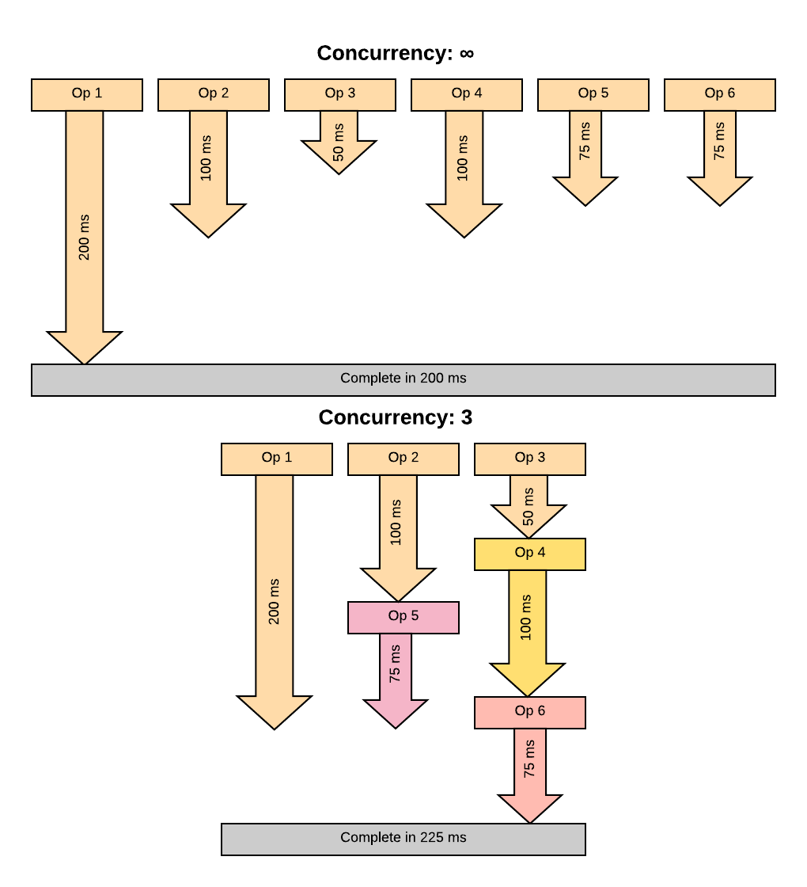

# Async Concurrency

## Definitions
A concurrency limit (shortened to Concurrency) is the number of operations that are allowed to execute at the same time (concurrently), particularly in a series of asynchronous operations.

## Observations
When consuming data from an API with follow-up requests, you can often end up making a large number of requests at the same time.  If you make too many requests at once to any given endpoint or API, you can either overwhelm the API or result in error code 429 (Too Many Requests).

To minimize both, you can specify a concurrency limit for any collection of requests.

N.B.: Use a [library](AsyncLibraries.md) to impose concurrency limits, as the required code is [complicated and arcane](https://github.com/sindresorhus/p-limit/blob/master/index.js) (and other people have already made robust libraries).

## Visuals
The following example below assumes that you have a set of 6 asynchronous operations that are invoked at the same time, with the results of using different concurrency limits.

