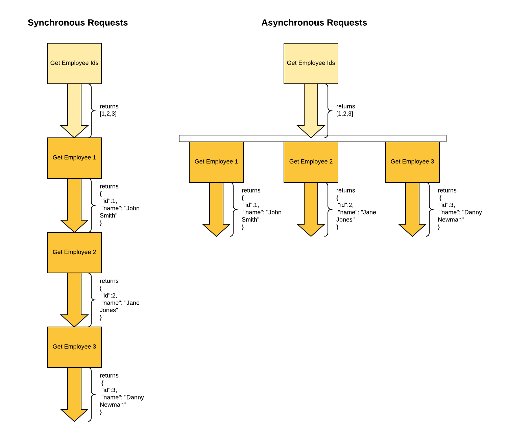

# Synchronous vs Asynchronously Calls

## Definitions
Synchronous calls are executed in a sequence, blocking execution for each operation in the sequence before the next one is commenced.

Asynchronous calls are executed as potentially overlapping operations which have callbacks or handlers for when the operation completes.  Async code does not block execution of the code that invokes it.

## Observations
If a developer thinks about calling web requests (or any fundamentally async operation) synchronously, they will write code that is either incorrect or inefficient.

For example, if you make a call that is async but do not wait for the response, the result will be undefined or incorrect with undesired behavior.  If you write the code to wait for the response, but block all other execution that could be happening at the same time, you'll be wasting precious execution time.

